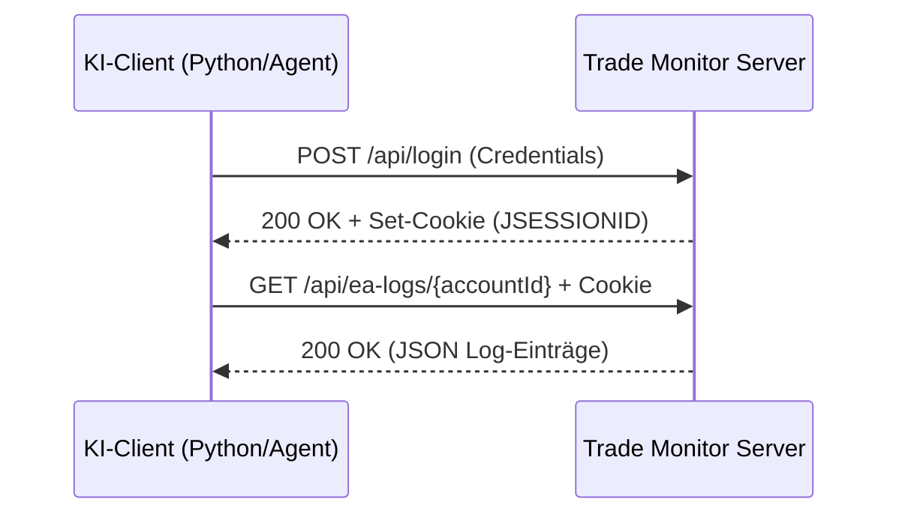

# Downloaden von MetaTrader EA-Logs für die KI-Analyse

Diese Anleitung beschreibt, wie ein externer KI-Client (z. B. ein Python-Skript, ein Agent oder eine GPT-Action) sich am MQL Trade Monitor authentifiziert und die Logdaten eines MetaTrader-Kontos für die Analyse herunterlädt.

---

## 1. Übersicht des Ablaufs

Da der Endpunkt zum Abrufen der Logs geschützt ist, muss die Kommunikation in drei Schritten erfolgen:



---

## 2. Schritt-für-Schritt Anleitung

### Schritt 1: Authentifizierung & Session abrufen

Der KI-Client sendet seine Benutzerdaten per JSON-POST an den Login-Endpunkt.

* **URL:** `https://<deine-domain>/api/login`
* **Methode:** `POST`
* **Headers:** `Content-Type: application/json`
* **Body:**
  ```json
  {
    "username": "dein_benutzername",
    "password": "dein_passwort"
  }
  ```
* **Antwort-Header:**
  Der Server antwortet mit einem `Set-Cookie`-Header, der die Session-ID enthält:
  `Set-Cookie: JSESSIONID=ABC123XYZ...; Path=/; HttpOnly`

*(Alternativ kann für Testzwecke der Demo-Login unter `POST /api/demo-login` mit einem leeren JSON-Body `{}` aufgerufen werden, falls dieser in den Einstellungen aktiviert ist).*

---

### Schritt 2: Logdaten herunterladen

Unter Verwendung des empfangenen `JSESSIONID`-Cookies können die Logs für ein bestimmtes Konto abgefragt werden.

* **URL:** `https://<deine-domain>/api/ea-logs/{accountId}`
* **Methode:** `GET`
* **Headers:** 
  * `Cookie: JSESSIONID=<deine-session-id>`
  * `Accept: application/json`

* **Antwort (JSON-Array):**
  Der Server liefert die letzten 5.000 Log-Einträge chronologisch absteigend sortiert (neueste zuerst):
  ```json
  [
    {
      "id": 14205,
      "timestamp": "11.06.2026 15:04:12",
      "logLine": "2026.06.11 15:04:12.450 - ToTheMoon EURUSD,M5: open buy trade success, ticket #481920"
    },
    {
      "id": 14204,
      "timestamp": "11.06.2026 15:00:00",
      "logLine": "2026.06.11 15:00:00.120 - ToTheMoon EURUSD,M5: equity snapshot: 10450.20, balance: 10000.00"
    }
  ]
  ```

---

## 3. Implementierungs-Beispiele

### A. Bash / cURL
Hier ist ein einfaches Shell-Skript, das die Session in einer Cookie-Datei (`cookies.txt`) speichert und anschließend die Logs herunterlädt.

```bash
#!/bin/bash
DOMAIN="https://monitor.tnickel-ki.de"
ACCOUNT_ID="12345678"
USERNAME="admin"
PASSWORD="secure_password"

# 1. Login und Cookie speichern
curl -s -c cookies.txt -X POST \
  -H "Content-Type: application/json" \
  -d "{\"username\":\"$USERNAME\",\"password\":\"$PASSWORD\"}" \
  "$DOMAIN/api/login" > /dev/null

# 2. Logs mit Cookie herunterladen
curl -s -b cookies.txt -X GET \
  -H "Accept: application/json" \
  "$DOMAIN/api/ea-logs/$ACCOUNT_ID"
```

---

### B. Python (Empfohlen für KI-Pipelines)
Python eignet sich hervorragend, um die Logdaten direkt in ein KI-Modell (z. B. via OpenAI API oder Google Gemini API) einzuspeisen. `requests.Session` verwaltet die Cookies dabei automatisch.

```python
import requests
import json

# Konfiguration
BASE_URL = "https://monitor.tnickel-ki.de"
ACCOUNT_ID = 12345678
USERNAME = "admin"
PASSWORD = "secure_password"

# Session-Objekt erstellen (automatische Cookie-Verwaltung)
session = requests.Session()

# 1. Authentifizierung durchführen
login_url = f"{BASE_URL}/api/login"
credentials = {"username": USERNAME, "password": PASSWORD}

try:
    response = session.post(login_url, json=credentials)
    response.raise_for_status()
    print("Authentifizierung erfolgreich.")
except requests.exceptions.HTTPError as e:
    print(f"Login fehlgeschlagen: {e}")
    exit(1)

# 2. Logdaten abrufen
logs_url = f"{BASE_URL}/api/ea-logs/{ACCOUNT_ID}"
try:
    logs_response = session.get(logs_url)
    logs_response.raise_for_status()
    logs_data = logs_response.json()
    
    # Beispiel-Ausgabe: Zeige die ersten 5 Logzeilen
    print(f"\n{len(logs_data)} Log-Einträge empfangen. Die neuesten Zeilen:")
    for entry in logs_data[:5]:
        print(f"[{entry['timestamp']}] {entry['logLine']}")
        
except requests.exceptions.RequestException as e:
    print(f"Fehler beim Laden der Logs: {e}")
```

---

## 4. Formatierung für LLM-Prompts
Für eine effiziente Verarbeitung durch eine KI empfiehlt es sich, die empfangenen JSON-Einträge in eine flache Textform umzuwandeln, um Token zu sparen:

```python
# JSON in flachen Text für das LLM konvertieren
llm_input_text = "\n".join([f"{item['logLine']}" for item in reversed(logs_data)])
# Nun kann llm_input_text dem System-Prompt beigefügt werden
```

> [!IMPORTANT]
> Der Server liefert die Logs in **absteigender Reihenfolge** (neueste zuerst). Für die meisten KIs ist es logischer, die Logs in **aufsteigender Reihenfolge** (chronologisch sortiert) zu lesen. Verwende daher eine Umkehrung der Liste (z. B. `reversed()`), bevor der Text an das LLM gesendet wird.
