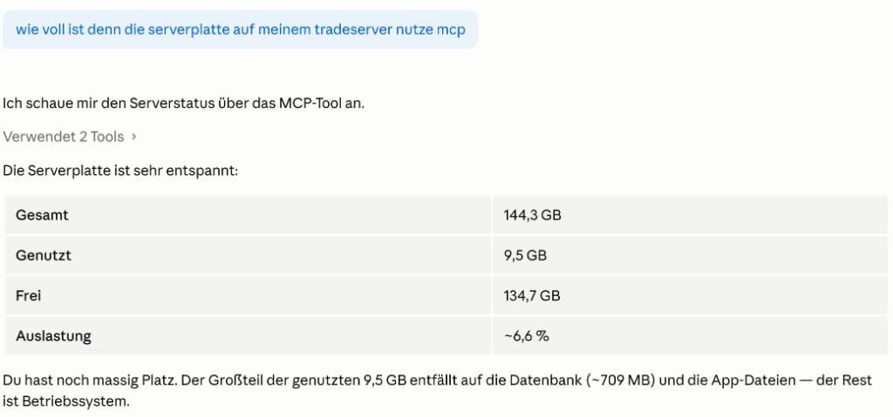
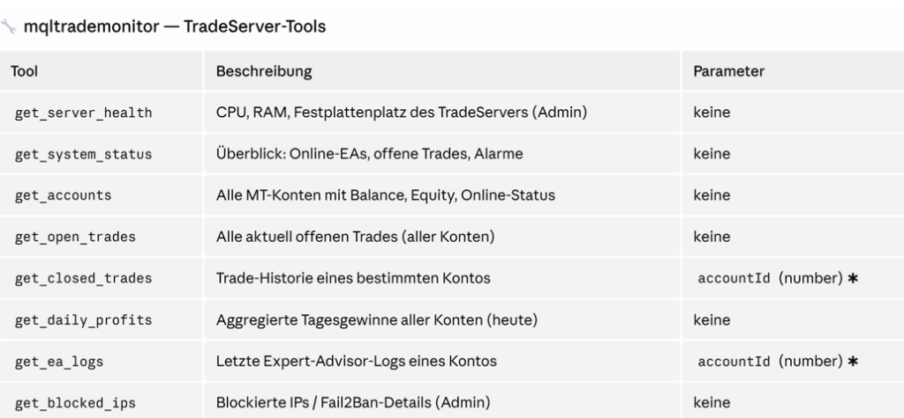
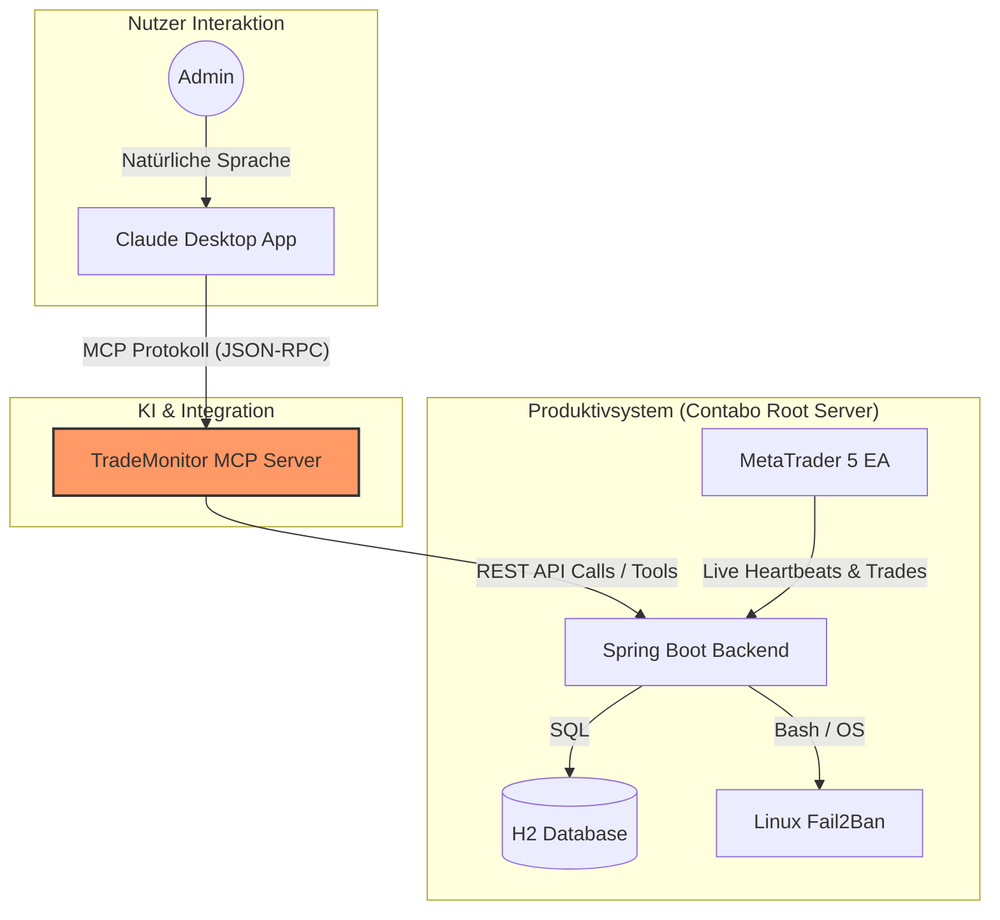

# Video-Konzept: MQL Trade Monitor Präsentation (10 Minuten)

**Zielgruppe:** CEOs, CTOs, Headhunter und IT-Recruiter
**Ziel:** Verkauf deiner Fähigkeiten als Senior Full-Stack Entwickler (Problemversteher, Architekt, Umsetzer)
**Kernaussage:** *"Ich schreibe nicht nur Code, ich löse komplexe Business-Probleme und baue produktionsreife, sichere Gesamtsysteme (vom Linux-Kernel bis zum 3D-Frontend)."*

---

## 🎬 Struktur des Videos (10 Minuten)

### 1. Der Hook & Das Business-Problem (Min 0:00 - 2:00)
*Fang auf keinen Fall mit Code an! CEOs wollen wissen: Welches Problem wird gelöst?*
* **Visuell:** Du bist im Bild (kurze Begrüßung), dann Wechsel auf das **Haupt-Dashboard** mit echten Daten.
* **Story:** "Wer im algorithmischen Handel tätig ist, kennt das Problem: Dutzende Server, verschiedene Broker, unterschiedliche Zeitzonen. Wenn ein System ausfällt oder der Drawdown kritisch wird, kostet das echtes Geld. Ich habe mit dem *MQL Trade Monitor* ein zentrales Nervensystem entwickelt, das all das in Echtzeit überwacht."
* **Highlights zeigen:**
    * Das asynchrone Dashboard (Lightning-fast, lädt im Hintergrund, kein Ruckeln).
    * Die exakte Drawdown-Berechnung (Unterscheidung zwischen echten Verlusten und harmlosen Auszahlungen).

### 2. Deep-Dive: Stabilität & Architektur (Min 2:00 - 4:00)
*Hier zeigst du dem CTO/Headhunter, dass du komplexe Systeme skalierbar aufbauen kannst.*
* **Visuell:** Wechsel zur **Server Health & Network Timeline**. Zeige, wie man in der Timeline flüssig zoomen kann.
* **Story:** "Eine schöne UI nützt nichts, wenn der Server bei 100 Clients in die Knie geht. Die Architektur basiert auf Spring Boot. Um Latenzen zu eliminieren, kommunizieren die MetaTrader-Terminals über asynchrone Heartbeats."
* **Highlights zeigen:**
    * Die Network-Timeline (Millisekunden-genaues Tracking von Ausfällen).
    * **Auto-Maintenance Mode:** Erwähne, wie das System Updates (Hot-Deploys) automatisch erkennt und die Verbindungen schont (Stichwort: Zero-Downtime Deployment).

### 3. Das Highlight: Military-Grade Security Audit (Min 4:00 - 7:00)
*Das ist dein absoluter "Wow"-Moment. Hier zeigst du, dass du über den Tellerrand der Java-Welt hinausblickst und Linux, Netzwerke und WebGL beherrschst.*
* **Visuell:** Wechsel in das neue **Security Audit Dashboard** und klicke auf den **3D Globus**.
* **Story:** "Ein Finanzsystem im Internet wird täglich angegriffen. Ich habe eine automatisierte Cyber-Defense-Schicht integriert."
* **Highlights zeigen:**
    * Zeige die Liste der gebannten IPs und erkläre, dass dein Java-Backend über sichere Wrapper-APIs direkt mit dem **Linux-Fail2Ban** auf OS-Ebene kommuniziert.
    * Öffne den **3D Globus**: "Ich parse die Angreifer-IPs, route sie durch eine Geo-Location-API und visualisiere die Angriffsvektoren live auf diesem rotierbaren, taktischen 3D-Globus (Three.js/Globe.gl). Das gibt Administratoren sofortige visuelle Kontrolle."
    * *(Das zeigt extremes Frontend-Können gepaart mit Backend-Security).*

### 4. Die Zukunft der Interaktion: KI & Model Context Protocol (MCP) (Min 7:00 - 9:00)
*Jedes Unternehmen sucht aktuell Leute mit KI-Erfahrung. Hier zeigst du, dass du KI nicht nur als Chatfenster nutzt, sondern tief in deine Systemlandschaft integrierst.*
* **Visuell:** Zeige einen neuen "MCP/AI"-Button im Admin-Bereich oder wechsle direkt zur Claude-Desktop-Oberfläche, die mit deinem TradeMonitor verbunden ist. 
* **Story:** "Um Support-Anfragen abzufangen und das Server-Management zu revolutionieren, habe ich den TradeMonitor um einen **Model Context Protocol (MCP) Server** erweitert. Das bedeutet: Ein LLM wie Claude kann jetzt direkt über definierte Schnittstellen (Tools) mit dem TradeMonitor-Backend sprechen."
* **Highlights zeigen:**
    * **Natürliche Sprache als Interface:** Zeige das Beispiel-Szenario im Chat: *"wie voll ist denn die serverplatte auf meinem tradeserver nutze mcp"*. 
      
      *Erkläre: "Anstatt Dashboards zu durchsuchen, fragt der Admin in natürlicher Sprache. Claude nutzt mein `get_server_health` Tool und gibt sofort die Antwort."*
    * **Das Tooling-Konzept:** Präsentiere einen Auszug der MCP-Befehle (get_system_status, get_accounts, get_open_trades, get_blocked_ips).
      
      *Erkläre: "Das LLM weiß exakt, welche API-Endpunkte es aufrufen muss, um Live-Daten aus der Produktion zu holen."*
    * **Der Reality-Check (Wichtiger Pitch-Moment):** "Die reine Implementierung des MCP-Servers dauerte dank KI-Unterstützung nur 10 Minuten. Aber das System in Claude zu integrieren, das Debugging der Verbindungen und das Feintuning der Prompts – das hat eine weitere Stunde harte Ingenieursarbeit erfordert. **Das zeigt:** KI ist unglaublich schnell beim Generieren von Code, aber es braucht erfahrene Entwickler, die Architekturen verstehen und komplexe Integrationsprobleme in der echten Welt lösen können. Das war für mich kein Problem, aber hier trennt sich die Spreu vom Weizen."
    * **Produktivsystem vs. Demosystem:** "Ganz wichtig: Das hier ist **kein Demosystem**, das auf localhost läuft. Es handelt sich um ein vollwertiges, produktives System auf einem Linux-Root-Server (Contabo), das echtes Geld und reale Trading-Konten in Echtzeit überwacht."

### 4.1 Technologie-Diagramm (Einblenden für technische Reviewer)
*Zeige kurz dieses Diagramm, um Architekten zu beeindrucken.*

### 5. Outro & Call to Action (Min 9:00 - 10:00)
* **Visuell:** Wieder du im Bild oder deine Kontakt/Portfolio-Seite (`tnickel-ki.de`).
* **Story:** "Das war ein kurzer Einblick. Dieses Projekt zeigt meine Arbeitsweise: Ich baue keine isolierten Scripte, sondern sichere, performante und visuell herausragende End-to-End-Produkte. Von der Linux-Firewall über das Java-Backend bis zur 3D-Frontend-Visualisierung. Ich suche aktuell nach einer neuen Herausforderung – kontaktieren Sie mich gerne über mein Portfolio."

---

## 💡 Tipps für die Aufnahme
* **Kein Quellcode:** Zeige im Video **keinen Code**. Ein CEO kann damit nichts anfangen, ein CTO sieht lieber das fertige Architektur-Ergebnis. Wenn sie Code sehen wollen, schauen sie in dein GitHub.
* **Pacing:** Sprich ruhig, aber bleibe nicht zu lange auf einem Bildschirm. Klicke gezielt durch die Menüs, während du sprichst, um Dynamik zu erzeugen.
* **Qualität:** Nutze ein gutes Mikrofon und nimm den Bildschirm in 4K oder mindestens 1080p auf. Die Ästhetik des Dark-Modes und des Globus muss knackscharf wirken.
